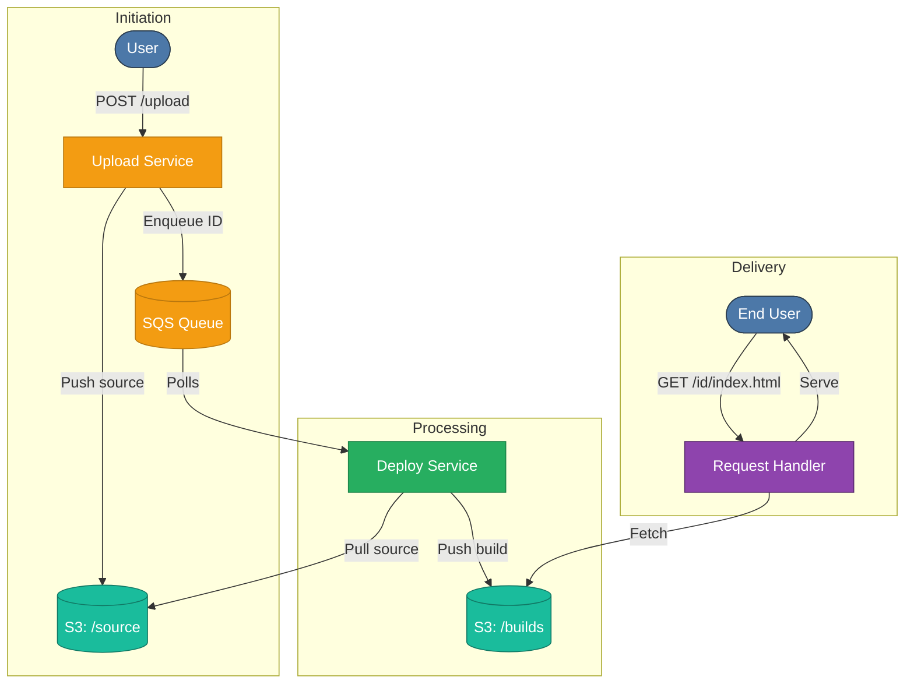

# Autodeploy: A Static Hosting Platform

A scalable, multi-tenant static hosting platform built with **TypeScript** and **AWS**, designed to automate deployments of web projects directly from a Git repository.

This project mimics the core workflow of Vercel: cloning a repository, building the project, and serving static output on a unique URL.

---

## Features

- Git-based deployments — deploy directly from a Git repo  
- Multi-tenant hosting — every deployment gets a unique ID and URL  
- Asynchronous builds — background workers handle compilation via SQS  
- Static content delivery — assets served directly from S3  
- Decoupled microservices — each service is independent and scalable  

---

## Limitations (WIP)

- No custom domains yet (only `<deployment-id>.yourdomain.com`)  
- No CDN / caching layer (CloudFront integration pending)  
- Only supports Node.js projects with `npm run build` by default  

---

## Architecture & Core Concepts

The system is composed of three microservices that communicate asynchronously using AWS S3 and SQS.

1. **Upload Service**  
   - Accepts a Git repo URL.  
   - Generates a deployment ID.  
   - Uploads source to `s3://bucket/source/<deployment-id>/`.  
   - Sends the deployment ID to SQS.  

2. **Deploy Service**  
   - Polls SQS for new deployments.  
   - Downloads source, runs `npm run build`.  
   - Uploads static assets to `s3://bucket/builds/<deployment-id>/`.  

3. **Request Handler Service**  
   - Receives HTTP requests from users.  
   - Extracts deployment ID + file path.  
   - Fetches the correct file from `s3://bucket/builds/...`.  
   - Serves it back with proper `Content-Type`.  

---

## Architecture Diagram



---

## Getting Started

### Prerequisites

- Node.js (v18 or higher)
- NPM or Yarn
- An AWS account with configured credentials (IAM user with S3 and SQS access)
- (Optional) Docker

### Setup

1. **Clone the repository:**
   ```bash
   git clone https://github.com/kanishkdhebana/Vercel.git
   cd Vercel
   ```

2. **Install dependencies:**
   ```bash
   npm install
   ```

3. **Configure Environment Variables:**
4. 
   Create a .env file in the root of the project:

```
  # AWS Credentials
  AWS_ACCESS_KEY_ID=YOUR_AWS_ACCESS_KEY
  AWS_SECRET_ACCESS_KEY=YOUR_AWS_SECRET_KEY
  AWS_REGION=your-aws-region
  
  # AWS Resources
  S3_BUCKET_NAME=your-unique-s3-bucket-name
  SQS_QUEUE_URL=your-sqs-queue-url
```


5. **Build and run services (in separate terminals)**
 ```bash
  # build the project
  npx tsc -b
  
  # run the service
  node ./dest/index.js
 ```

---

## Example Workflow

1. **Upload:**  
   ```bash
    curl -X POST http://localhost:3000/upload \
      -H "Content-Type: application/json" \
      -d '{"repoUrl":"https://github.com/user/my-site"}'
    # => { "deploymentId": "abc123" }
   ```

2. **Access:**  
   ```
     http://abc123.yourdomain.com
   ```

3. **Serve:**  
   End users access the site via a custom subdomain; the Request Handler Service fetches and streams the correct files from S3.

## Next Steps

This project demonstrates how to build a simplified, Vercel-like static hosting system using AWS primitives (S3 + SQS).  

Next would be:
- Have a frontend (a website)

---

## Contributing

Contributions, issues, and feature requests are welcome!  
Feel free to open a pull request or file an issue if you'd like to help improve this project.
